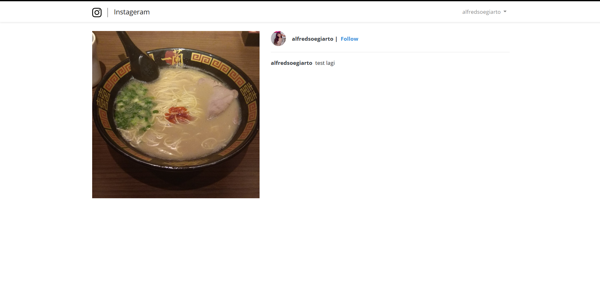
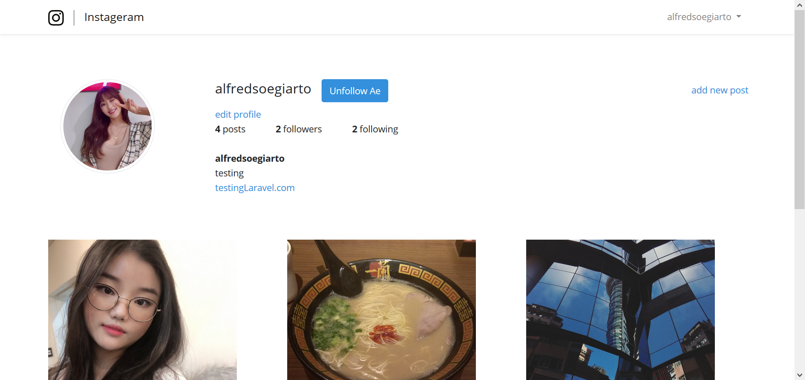

# Instageram

Simple Instagram Clone with CRUD functions

# Home

Home page where you can see all the posts from people you follow

# Post Details

Page to see post details like captions

# User Profile

User Profile page where user can see their bio, description and links along with pictures that they've posted before, they can also edit their profile and add new posts.
Other users can also follow users that they like.

# Insert New Post

Page to create new posts

# Edit Profile

Page to edit User's Profile
